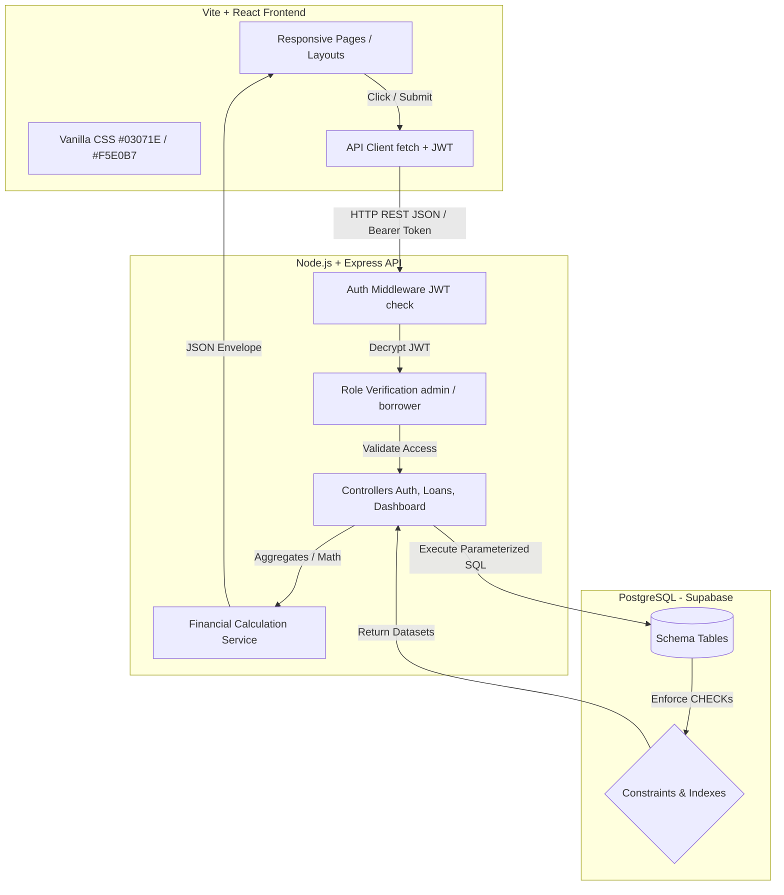
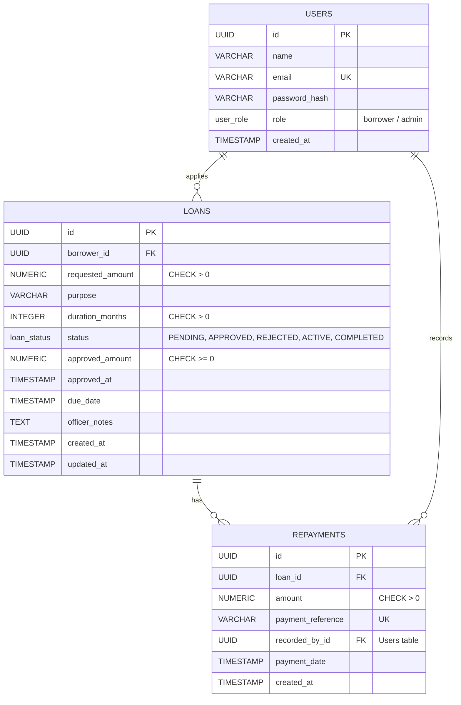

# Micro-Loan Tracker (MVP Capstone Project)

A focused, professional digital tracking system built to replace manual, paper-based and spreadsheet workflows for micro-loan operations in Nigeria.

---

## 📖 Project Context & Problem Statement

In Nigeria, many small-scale micro-loan lenders and cooperative groups track client applications, cash disbursements, and repayments using notebooks or fragmented spreadsheets. This leads to several operational risks:
- **Fragmented History**: Hard to track loan histories or retrieve a borrower's outstanding debt.
- **Manual Errors**: High risk of mathematical mistakes when subtracting repayments from principal balances.
- **Delayed Approvals**: Difficulty searching and filtering pending applications.
- **Lack of Access Control**: Borrowers cannot securely check their current outstanding balance or payment schedules.

**The Solution**: The **Micro-Loan Tracker** is an MVP designed around a solid database schema and backend REST API. It ensures that calculations are computed on the database/backend level, enforces rigid state machine status transitions, and presents a responsive interface for both Borrowers and Loan Officers.

---

## 🎨 Visual Identity & Colors

Adhering strictly to the standard design specifications, the platform's brand is centered around two primary colors:
- **Primary Dark Navy**: `#03071E` (Used for header bars, tables, buttons, and branding)
- **Primary Warm Cream**: `#F5E0B7` (Used as highlighting, badges, active indicators, and text accents)

Auxiliary neutrals (grays, whites) are utilized for legibility, with success green (`#10b981`) and danger red (`#ef4444`) restricted to status feedback.

---

## ⚡ Features

### 1. Borrower Account
- **Secure Registration / Login**: Account creation defaults to the borrower role.
- **My Dashboard**: View key stats: *Total Borrowed*, *Active Outstanding Balance*, *Active Loans*, and *Completed Loans*.
- **Submit Loan Request**: Form to enter requested amount (₦), duration (1-12 months), and purpose.
- **Auditable Ledger**: View table of all past requests and inspect detailed repayments lists recorded by staff.

### 2. Loan Officer / Administrator
- **Operational Metrics**: View system-wide stats: *Total Disbursements*, *Recovered Capital*, *Active Portfolio Balance*, and *Pending Review Queue size*.
- **Review Workspace**: View borrower applications table, search by name/email/purpose, and filter by status.
- **State Machine Control**: Approve requests (specifying approved amount, due date, review notes) or reject them.
- **Disbursement Switch**: Confirm cash hand-offs, moving loans from `APPROVED` to `ACTIVE`.
- **Repayment Logger**: Record client payments with checking constraints to prevent overpayments.

---

## 🏗️ System Architecture



---

## 💾 Database Design

The database contains three tables with foreign keys and database-level constraints.



### Table 1: `users`
- Tracks account credentials. Password hashes are encrypted using `bcryptjs`.
- Custom ENUM type: `user_role` (`'borrower'`, `'admin'`).

### Table 2: `loans`
- Represents applications and disbursals.
- Status ENUM: `loan_status` (`'PENDING'`, `'APPROVED'`, `'REJECTED'`, `'ACTIVE'`, `'COMPLETED'`).
- **Database CHECK Constraint (`check_approval_details`)**:
  - Enforces that `approved_amount`, `approved_at`, and `due_date` must remain `NULL` if status is `PENDING` or `REJECTED`.
  - Enforces that these details **must** be populated if status is updated to `APPROVED`, `ACTIVE`, or `COMPLETED`.

### Table 3: `repayments`
- Logs payment receipt metadata.
- Includes `payment_reference` check constraint (`UNIQUE`) to block duplicate receipts.
- Tracks `recorded_by_id` to log which staff admin recorded the cash.

---

## 🔌 API Endpoint Specification

All endpoints return a standardized JSON response envelope:
- **Success**: `{ "success": true, "data": ... }`
- **Failure**: `{ "success": false, "error": { "message": "Error details" } }`

| Method | Endpoint | Access | Description |
| :--- | :--- | :--- | :--- |
| **POST** | `/api/auth/register` | Public | Registers borrower. Returns user object & token. |
| **POST** | `/api/auth/login` | Public | Authenticates credentials. Returns user object & token. |
| **GET** | `/api/auth/me` | Logged In | Retrieves active user profile information. |
| **POST** | `/api/loans` | Borrower | Submit loan application details. |
| **GET** | `/api/loans` | Logged In | List requests. Admins see all; borrowers see only their own. |
| **GET** | `/api/loans/:id` | Owner/Admin | Fetch loan folder, details, stats, and repayment lines. |
| **PATCH**| `/api/loans/:id/status` | Admin | Process approval (PENDING->APPROVED/REJECTED or APPROVED->ACTIVE). |
| **POST** | `/api/loans/:id/repayments` | Admin | Record a payment receipt. Completes loan if balance hits zero. |
| **GET** | `/api/dashboard/summary` | Logged In | Fetch dashboard widgets data based on active role. |

---

## 🛠️ Local Installation & Setup

Follow these steps to run the complete stack on your local machine:

### Prerequisites
- Node.js (v18 or higher)
- NPM (v9 or higher)
- PostgreSQL database (Local or hosted Supabase account)

### Step 1: Clone the Codebase
Navigate into your target project directory:
```bash
cd Micro_loan-tracker
```

### Step 2: Configure the Backend Database
1. Go to your **Supabase Dashboard**, open the **SQL Editor**, and copy-paste the contents of [schema.sql](file:///c:/Users/Administrator/Desktop/Micro_loan-tracker/backend/src/db/schema.sql) to build tables, constraints, and indexes.
2. (Optional Demo Data) Paste the contents of [seed.sql](file:///c:/Users/Administrator/Desktop/Micro_loan-tracker/backend/src/db/seed.sql) into the Supabase editor and run it to establish mock loans and logins.

### Step 3: Configure Backend Environment Variables
1. Navigate into the backend folder:
   ```bash
   cd backend
   ```
2. Create a `.env` file copying the keys from `.env.example`:
   ```bash
   copy .env.example .env
   ```
3. Open `.env` and fill in your connection string and credentials:
   - `DATABASE_URL`: Your Supabase PostgreSQL Connection URI.
   - `JWT_SECRET`: A secure key string for cryptography.
   - `PORT`: Set to `5000`.

### Step 4: Run Backend
1. Install server dependencies:
   ```bash
   cmd /c npm install
   ```
2. Start the Express API server:
   ```bash
   npm run dev
   ```
   The backend will boot up at `http://localhost:5000`.

### Step 5: Configure & Launch Frontend
1. Open a new terminal session, navigate to the frontend folder:
   ```bash
   cd frontend
   ```
2. Install client dependencies:
   ```bash
   cmd /c npm install
   ```
3. Start the Vite React development server:
   ```bash
   npm run dev
   ```
   Open the browser at `http://localhost:5173`. You can log in using the demo accounts!

---

## 🧪 Testing Guide

We utilize Jest and Supertest to run tests against backend controllers, checking role access validations and arithmetic edge cases.

To run the test suite:
1. Navigate to the backend directory:
   ```bash
   cd backend
   ```
2. Execute the test scripts runner:
   ```bash
   npm test
   ```
This triggers 16 assertions spanning:
- Invalid status jumps (e.g. going from `APPROVED` back to `PENDING`).
- Borrower access blocks on admin endpoints.
- Repayments that exceed outstanding balances.

---

## 🚀 Deployment Guide

### Database Hosting (Supabase)
- Use the connection pool strings found under **Project Settings > Database > Connection Strings**.
- Ensure to check the **SSL Mode** flags. The backend configuration uses `rejectUnauthorized: false` to allow remote connections.

### Backend Hosting (Render, Fly.io, or Railway)
1. Link your GitHub repository.
2. Set Build Command to `npm install` and Start Command to `node src/server.js`.
3. Set environment variables:
   - `NODE_ENV=production`
   - `DATABASE_URL=your_supabase_pool_connection_string`
   - `JWT_SECRET=some_production_cryptography_key`
   - `FRONTEND_URL=your_production_vercel_url`

### Frontend Hosting (Vercel, Netlify, or Render)
1. Deploy Vercel pointing to the `frontend/` directory.
2. Set Framework Preset to **Vite**.
3. Set Build Command to `npm run build` and Output Directory to `dist`.
4. Configure environment variable:
   - `VITE_API_URL=your_production_backend_api_url`

---

## 🏫 Capstone Defense Prep (Q&A Checklist)

Use this cheat sheet to prepare for questions from your examiners:

**Q: How do you prevent borrowers from approving their own loans?**
> **Answer**: Security is enforced at the backend REST API layer, not just hidden in the React UI. Every status change route runs the `requireRole('admin')` middleware. This checks the encrypted JWT header, verifying the role claims decoded from the signature before running the update controllers.

**Q: Why use PostgreSQL `NUMERIC` types instead of float double precision for money?**
> **Answer**: JavaScript floating-point numbers can suffer from rounding inaccuracies (e.g. `0.1 + 0.2 === 0.30000000000000004`). In a finance app, rounding errors are unacceptable. PostgreSQL `NUMERIC(15, 2)` represents exact decimal digits, ensuring mathematical correctness for repayments and balances.

**Q: How are balance records updated without corruption?**
> **Answer**: Balances are calculated dynamically using SQL aggregate sums (`SUM(repayments.amount)`) or calculated within database transactions (`BEGIN`, `COMMIT`, `ROLLBACK`). This prevents race conditions where two simultaneous payment actions could write outdated balances.

**Q: What happens if a borrower makes a repayment that exceeds the remaining balance?**
> **Answer**: The backend repayment logger calculates the current outstanding balance using the `financialService`. If `repayment_amount > outstanding_balance`, the database transaction is aborted, no records are written, and the server returns a `400 Bad Request` explaining the error.

---

## 🛠️ Project Limitations & Future Roadmap
While the MVP implements all core requirements, a full production deployment would require:
1. **SMS/Email Reminders**: Automate notifications to borrowers using Twilio/Termii when a payment date approaches.
2. **Interest Calculations**: Incorporate compound or simple interest rates directly in the amortization schedule.
3. **Automated Gateway integration**: Connect Paystack or Flutterwave APIs to process Naira debit card payments directly on the frontend.
4. **Audit Trail Logs**: Create a ledger table to log every database access or change event.
